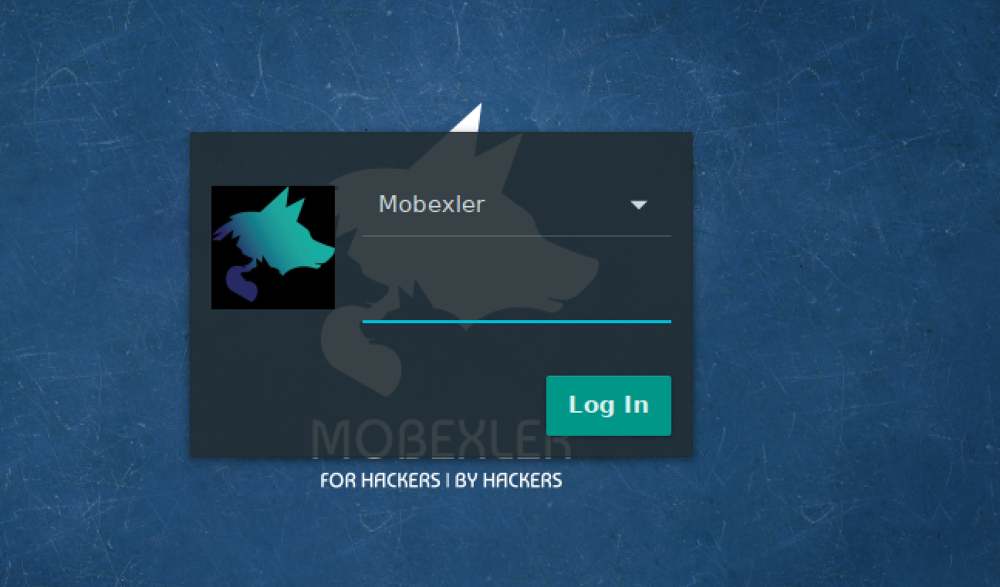
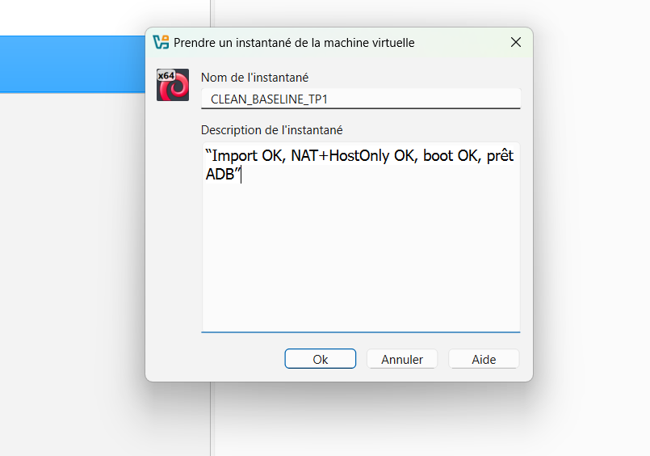
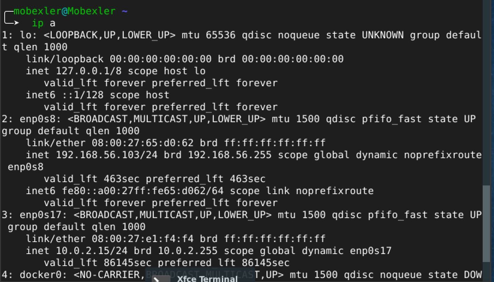
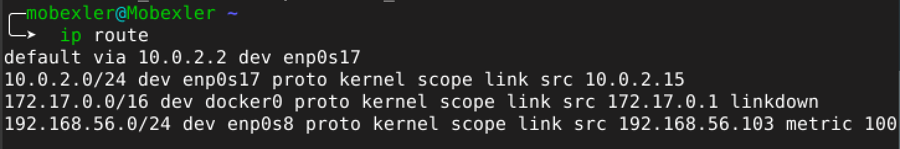
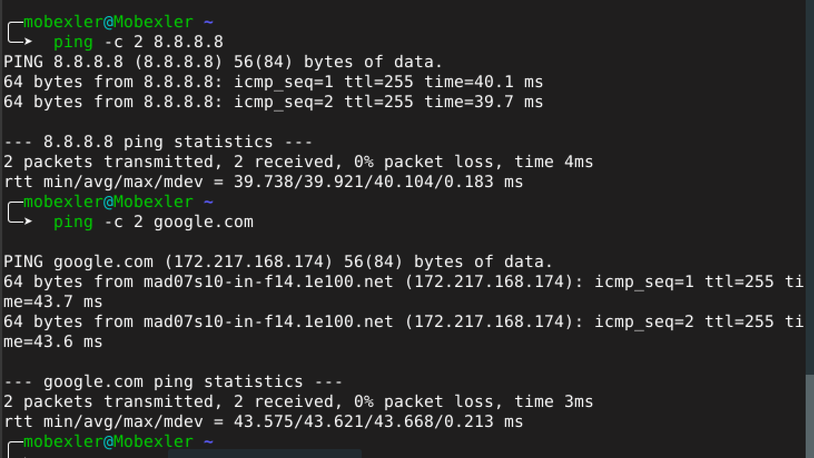
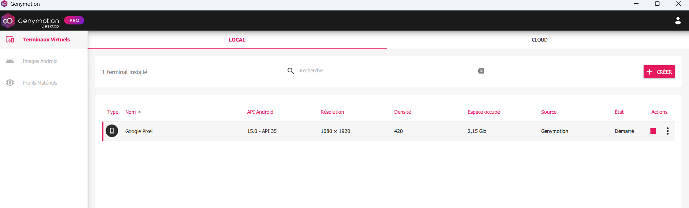
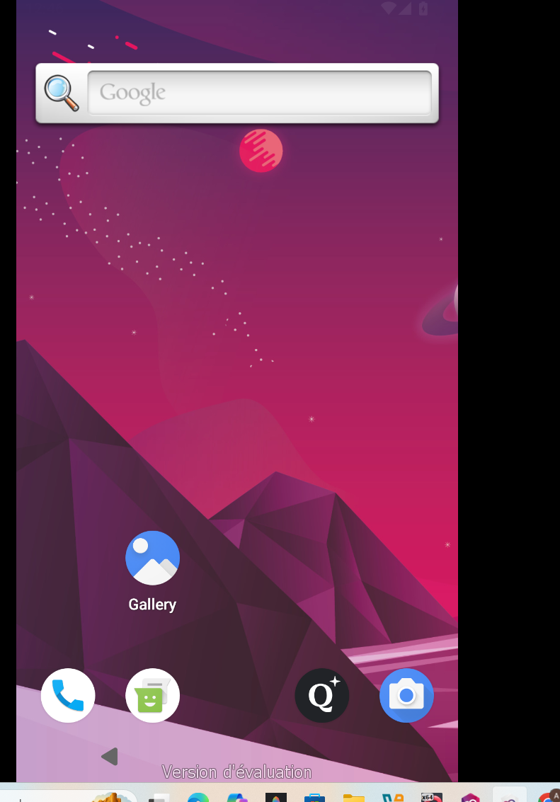
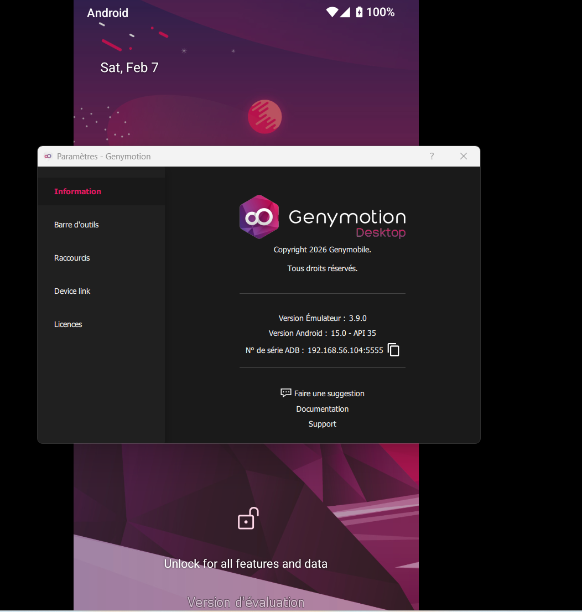
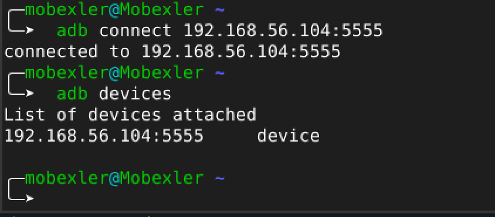

# mobile-security-lab
Lab 1 Sécurité des applications mobiles – Mobexler & Genymotion
## Objectif
Mettre en place un environnement de test pour la sécurité des applications mobiles en utilisant Mobexler et Genymotion avec une connexion ADB.
## Environnement
- Hyperviseur : VirtualBox
- VM : Mobexler
- Émulateur : Genymotion
- Android : API 35
- Réseau :
  - Adapter 1 : NAT
  - Adapter 2 : Host-Only
## Étape 1 – Démarrage de Mobexler

## Étape 2 – Création du snapshot CLEAN

## Étape 3 – Vérification de la configuration réseau de la VM Mobexler

## Étape 4 – Vérification de la table de routage de la VM Mobexler

## Étape 5 – Vérification de la connectivité Internet de la VM Mobexler

## Étape 6 – Lancement de l’émulateur Android avec Genymotion

## Étape 7 – Démarrage du système Android sur l’émulateur

## Étape 8 – Informations du terminal Android sur Genymotion

## Étape 9 – Connexion ADB réussie entre Mobexler et le terminal Genymotion

## Conclusion
Ce premier lab m'a permis de mettre en place un environnement fonctionnel pour l’analyse de la sécurité des applications mobiles en utilisant Mobexler et Genymotion. La configuration réseau ainsi que la connexion ADB entre la machine d’analyse et l’émulateur Android ont été validées avec succès. 
